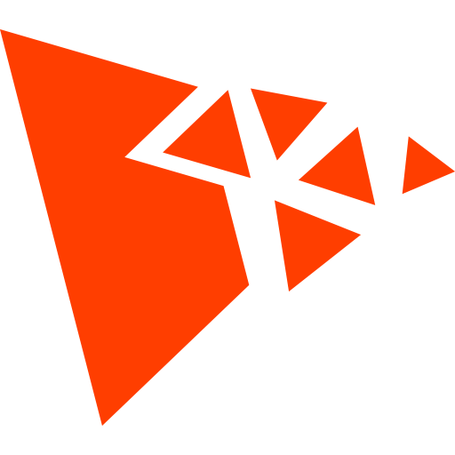

<p align="center">
  
</p>

# THREE Particles
[](https://github.com/NewKrok/three-particles/actions/workflows/test.yml)
[](https://www.npmjs.com/package/@newkrok/three-particles)
[](https://www.npmjs.com/package/@newkrok/three-particles)
[](https://bundlephobia.com/package/@newkrok/three-particles)

Particle system for ThreeJS.

# Features

*   Easy integration with Three.js.
*   Visual editor for creating and fine-tuning effects: [THREE Particles Editor](https://github.com/NewKrok/three-particles-editor)
*   Highly customizable particle properties (position, velocity, size, color, alpha, rotation, etc.).
*   Support for various emitter shapes and parameters.
*   Force fields and attractors for dynamic particle behavior (point attraction/repulsion, directional wind).
*   Sub-emitters triggered on particle birth or death events.
*   Serialization support for saving and loading particle system configs.
*   GPU instancing renderer (`RendererType.INSTANCED`) — removes `gl_PointSize` hardware limit, ideal for large particles or high particle counts.
*   Trail / Ribbon renderer (`RendererType.TRAIL`) — continuous ribbon trails behind particles with configurable width, opacity, and color tapering.
*   Mesh particle renderer (`RendererType.MESH`) — render each particle as a 3D mesh (debris, gems, coins) using GPU instancing with full 3D rotation and simple directional lighting.
*   TypeDoc API documentation available.

# Live Demo & Examples

*   **Editor & Live Demo:** [https://newkrok.com/three-particles-editor/index.html](https://newkrok.com/three-particles-editor/index.html)
*   **CodePen Basic Example:** [https://codepen.io/NewKrok/pen/GgRzEmP](https://codepen.io/NewKrok/pen/GgRzEmP)
*   **CodePen Fire Animation:** [https://codepen.io/NewKrok/pen/ByabNRJ](https://codepen.io/NewKrok/pen/ByabNRJ)
*   **CodePen Projectile Simulation:** [https://codepen.io/NewKrok/pen/jEEErZy](https://codepen.io/NewKrok/pen/jEEErZy)
*   **Video - Projectiles:** [https://youtu.be/Q352JuxON04](https://youtu.be/Q352JuxON04)
*   **Video - First Preview:** [https://youtu.be/dtN_bndvoGU](https://youtu.be/dtN_bndvoGU)

# Installation

## NPM

```bash
npm install @newkrok/three-particles
```

## CDN (Browser)

Include the script directly in your HTML:

```html
<script src="https://cdn.jsdelivr.net/npm/@newkrok/three-particles@latest/dist/three-particles.min.js"></script>
<!-- or -->
<script src="https://unpkg.com/@newkrok/three-particles@latest/dist/three-particles.min.js"></script>
```

# Usage

Here's a basic example of how to load and use a particle system:

```javascript
// Create a particle system
const effect = {
  // Your effect configuration here
  // It can be empty to use default settings
};
const { instance } = createParticleSystem(effect);
scene.add(instance);

// Update the particle system in your animation loop
// Pass the current time, delta time, and elapsed time
updateParticleSystems({now, delta, elapsed});
```

# Usage with React Three Fiber

The library works seamlessly with [React Three Fiber](https://github.com/pmndrs/react-three-fiber). No additional wrapper package is needed — use `createParticleSystem` directly with React hooks:

```tsx
import { useRef, useEffect } from "react";
import { useFrame } from "@react-three/fiber";
import {
  createParticleSystem,
  Shape,
  type ParticleSystem,
} from "@newkrok/three-particles";
import * as THREE from "three";

function FireEffect({ config }: { config?: Record<string, unknown> }) {
  const groupRef = useRef<THREE.Group>(null);
  const systemRef = useRef<ParticleSystem | null>(null);

  useEffect(() => {
    const system = createParticleSystem({
      duration: 5,
      looping: true,
      maxParticles: 200,
      startLifetime: { min: 0.5, max: 1.5 },
      startSpeed: { min: 1, max: 3 },
      startSize: { min: 0.3, max: 0.8 },
      startColor: {
        min: { r: 1, g: 0.2, b: 0 },
        max: { r: 1, g: 0.8, b: 0 },
      },
      gravity: -1,
      emission: { rateOverTime: 50 },
      shape: { shape: Shape.CONE, cone: { angle: 0.2, radius: 0.3 } },
      renderer: {
        blending: THREE.AdditiveBlending,
        transparent: true,
        depthWrite: false,
      },
      ...config,
    });

    systemRef.current = system;
    groupRef.current?.add(system.instance);

    return () => {
      system.dispose();
    };
  }, [config]);

  useFrame((_, delta) => {
    systemRef.current?.update({
      now: performance.now(),
      delta,
      elapsed: 0,
    });
  });

  return <group ref={groupRef} />;
}

// In your R3F Canvas:
// <Canvas>
//   <FireEffect />
// </Canvas>
```

**Key points:**
- Use `useEffect` to create and dispose the particle system
- Use `useFrame` to drive updates each frame (call `system.update()` instead of `updateParticleSystems()` for per-system control)
- Add the `system.instance` to a `<group>` ref so R3F manages the scene graph
- Return a cleanup function from `useEffect` that calls `system.dispose()`

# Documentation

Automatically generated TypeDoc: [https://newkrok.github.io/three-particles/api/](https://newkrok.github.io/three-particles/api/)

## Important Notes

### Color Over Lifetime

The `colorOverLifetime` feature uses a **multiplier-based approach** (similar to Unity's particle system), where each RGB channel curve acts as a multiplier applied to the particle's `startColor`.

**Formula:** `finalColor = startColor * colorOverLifetime`

**⚠️ Important:** To achieve full color transitions, set `startColor` to white `{ r: 1, g: 1, b: 1 }`. If any channel in `startColor` is set to 0, that channel cannot be modified by `colorOverLifetime`.

**Example - Rainbow effect:**
```javascript
{
  startColor: {
    min: { r: 1, g: 1, b: 1 },  // White - allows full color range
    max: { r: 1, g: 1, b: 1 }
  },
  colorOverLifetime: {
    isActive: true,
    r: {  // Red: full → half → off
      type: 'BEZIER',
      scale: 1,
      bezierPoints: [
        { x: 0, y: 1, percentage: 0 },
        { x: 0.5, y: 0.5, percentage: 0.5 },
        { x: 1, y: 0, percentage: 1 }
      ]
    },
    g: {  // Green: off → full → off
      type: 'BEZIER',
      scale: 1,
      bezierPoints: [
        { x: 0, y: 0, percentage: 0 },
        { x: 0.5, y: 1, percentage: 0.5 },
        { x: 1, y: 0, percentage: 1 }
      ]
    },
    b: {  // Blue: off → half → full
      type: 'BEZIER',
      scale: 1,
      bezierPoints: [
        { x: 0, y: 0, percentage: 0 },
        { x: 0.5, y: 0.5, percentage: 0.5 },
        { x: 1, y: 1, percentage: 1 }
      ]
    }
  }
}
```
